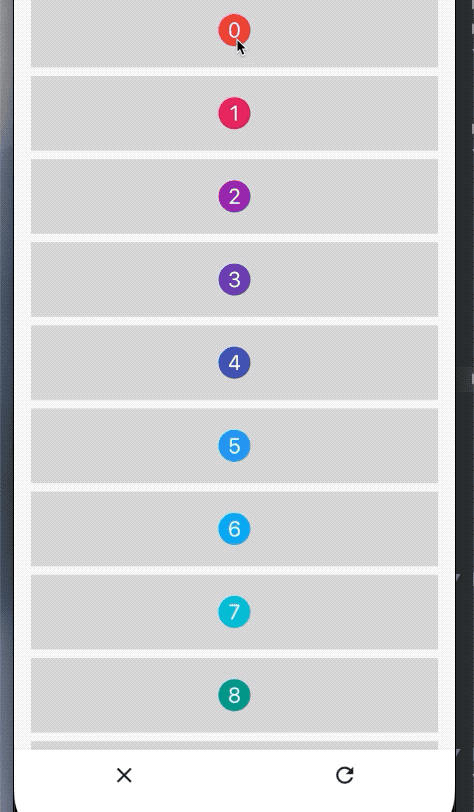
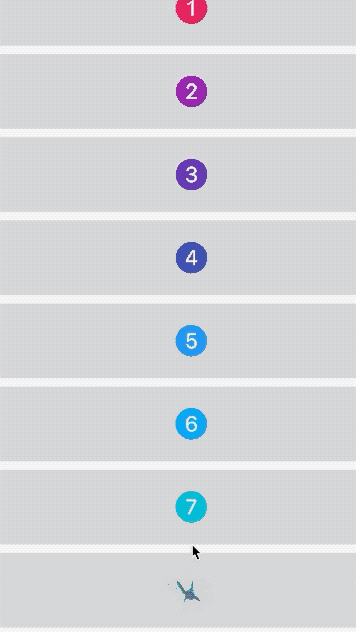
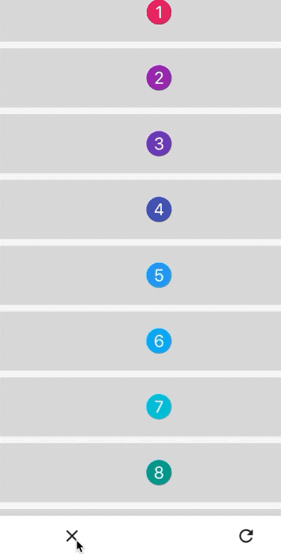

# flutter_qq_bubble


> 一个气泡拖拽效果的包。100%还原QQ效果。支持单个爆破与全体爆破。颜色自定义哦！！！


## 效果


效果图看不见？[去github看看](https://github.com/ifgyong/flutter_qq_bubble)
## 如何使用

## 配置`pubspec.yaml`

```dart
 flutter_qq_bubble: ^*.*.*
 
flutter pub get 

import 'package:flutter_qq_bubble/flutter_qq_bubble.dart';

```

> ⚠️ 注意： 具体版本
[点我查询详细版本](https://pub.flutter-io.cn/packages/flutter_qq_bubble)

## 属性说明：

```dart
/// 球之间断开连接的最大距离，基数是球的半径[radius],默认是[五倍]半径
final double maxMultipleDistance;

/// 拖拽删除回调
final GestureTapCallback deleteCallback;

/// 球半径，默认是[10]
final double radius;

/// 中间显示文本
final InlineSpan textSpan;

/// 爆炸倍数基于[radius],默认5倍,范围[1,100]
final double boomValue;

/// 使用eventbus销毁的key
final ValueKey boomKey;

/// 背景颜色
final Color backgroundColor;
```


## 支持单个气泡破碎



#### 首先声明的时候给定 一个`VaueKey`。
```dart

QQBubble(
.... dart
      boomKey: ValueKey(index)
      ...
    )
    
```
#### 爆破单个

```dart
qqEventBus.fire(Boom(ValueKey(0));
```

## 爆破所有 



## [喜欢就留下你的💕](https://github.com/ifgyong/flutter_qq_bubble)
## [LICENSE](LICENSE)